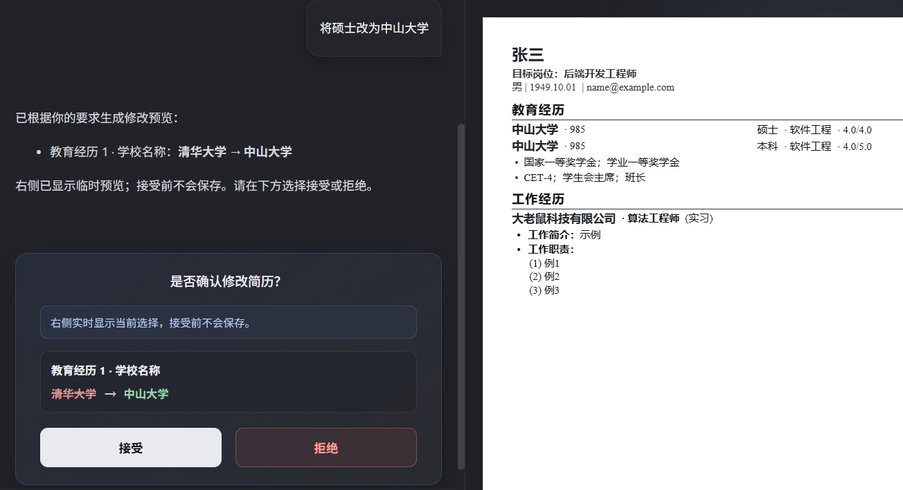
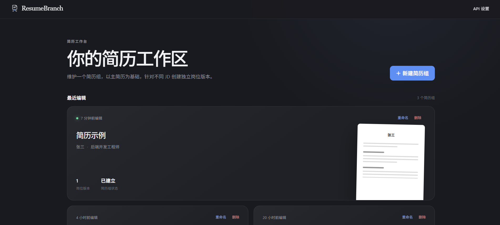
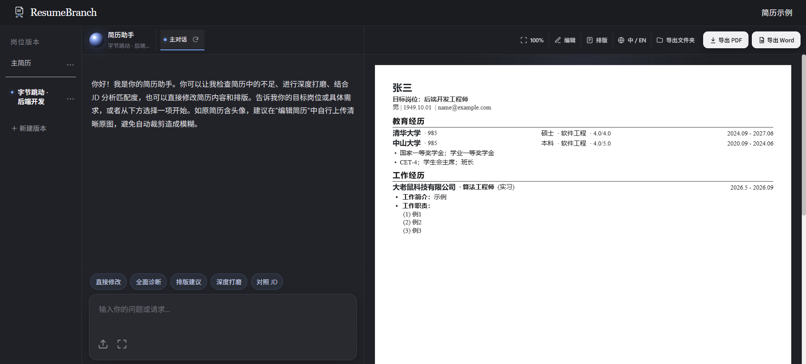
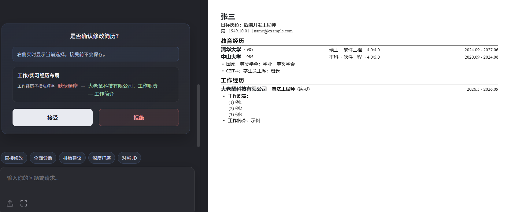
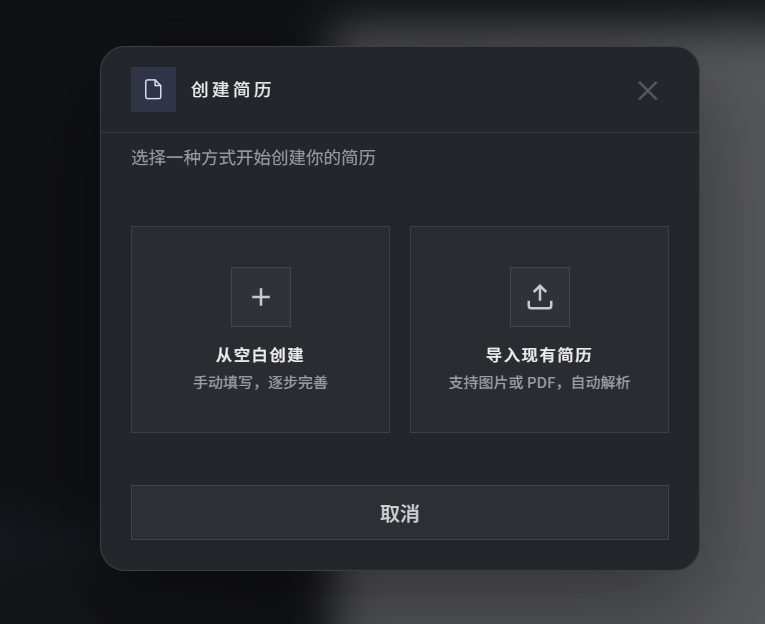
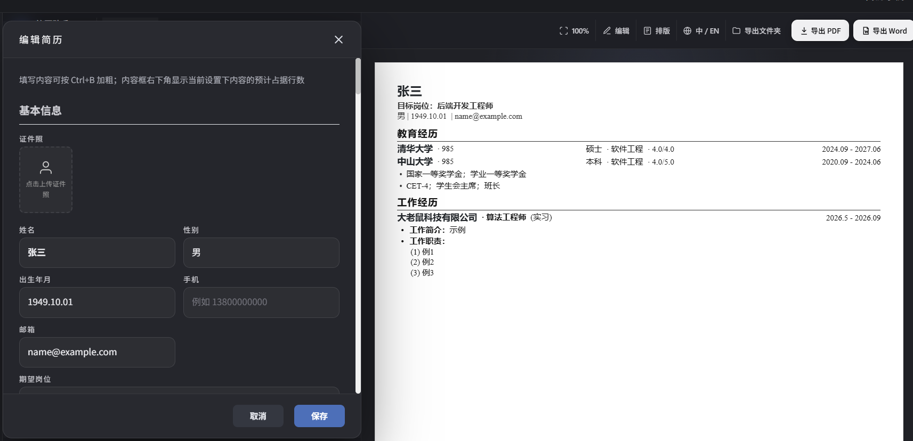
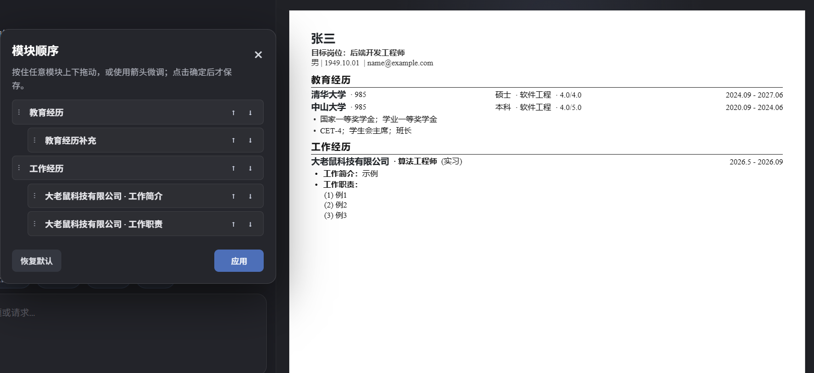

# ResumeBranch

**English** | [简体中文](README.md)

**ResumeBranch** is an AI resume workspace for resume maintenance and job-search coaching. It supports resume import, structured editing, JD branch management, AI diagnosis, safe editing, and PDF/DOCX export.

Unlike asking an LLM to rewrite a resume directly, ResumeBranch converts AI edits into structured operations, validates them, shows field-level differences and a layout preview before writing, and applies them formally only after user confirmation. Combined with deterministic routing, Agent Skills, and versioned context management, this improves editing efficiency, controllability, and traceability. The project provides a Windows single-user installer, source development/testing, and multi-user Docker Compose deployment.

The screenshot shows the full edit-preview boundary: the user request, the structured before/after change, the temporary resume preview, and the accept/reject controls. The canonical resume is not written before acceptance.

## Key Highlights

- **Hybrid Agent Routing**: explicit, safely parseable requests use the deterministic <code>direct_edit</code> path; consultations and complex tasks enter <code>conversation_llm</code> and call Agent Skills when needed.
- **Safe Edit Pipeline**: requests become structured operations, pass schema and capability validation, produce a working-copy candidate, diff, and layout preview, and are persisted only after confirmation.
- **Three Agent Skills**: <code>resume-edit</code> generates candidates, <code>resume-snapshot</code> supplies visual evidence from the real PDF pipeline, and <code>resume-coach</code> manages sourced evidence and edit authorization.
- **Context & Version Management**: <code>ProjectTask</code>, task-level locks, content/layout digests, bounded memory, and private Skill state define context and concurrency boundaries.
- **Evaluation & Delivery**: the repository includes 700 core Agent evaluation cases and three delivery paths: Windows installer, source testing, and multi-user Docker Compose.

## System Architecture

~~~mermaid
flowchart TD
    UI["Vue 3 Workspace"] --> API["FastAPI REST + SSE"]
    API --> SERVICES["Resume / Version / Task Services"]
    API --> ROUTER{"LangGraph Entry Router"}
    ROUTER --> PATHS["direct_edit / conversation_llm"]
    PATHS --> RUNTIME["SkillRuntime Discovery and Invocation"]
    RUNTIME --> SKILLS["resume-edit resume-snapshot resume-coach"]
    SKILLS --> RESULT["Structured Operations / Visual Evidence / Coach State"]
    RESULT --> OUTCOME{"Outcome"}
    OUTCOME -->|Answer / Clarify| RESPONSE["Answer / Visual Analysis"]
    OUTCOME -->|Edit Candidate| VALID["Schema Validation / Diff / Layout Preview"]
    VALID --> CONFIRM["User Confirm / Cancel POST /confirm"]
    SERVICES --> MODEL["Structured Resume Model"]
    CONFIRM --> MODEL
    MODEL --> DB["SQLite / MySQL"]
    MODEL --> EXPORT["PDF / DOCX Export"]
    DB --> REV["ResumeRevision / Undo"]
~~~

The frontend depends on public REST endpoints, SSE events, and confirmation results. Internal graph nodes, Skill names, and field paths are kept behind the application boundary. Import, editing, version management, and export share the structured resume model.

## Core Execution Flow: AI Does Not Directly Overwrite the Resume

~~~mermaid
flowchart TD
    A["User Request"] --> B{"Safely Parseable?"}
    B -->|Yes| C["direct_edit Deterministic Parsing"]
    B -->|No| D["conversation_llm Understand, Answer, or Ask"]
    D --> E{"Agent Skill Needed?"}
    E -->|No| F["Answer / Clarify"]
    E -->|Yes| G["SkillRuntime Invokes Skill"]

    C --> H["Structured Operations"]
    G --> I["Structured Tool Result"]
    I --> J{"Does It Require a Change?"}
    J -->|No| F
    J -->|Yes| H

    H --> P["Acquire Task-Level Edit Lock"]
    P --> K["resume-edit Applies Operations to a Working Copy"]
    K --> L["Schema and Layout Capability Validation"]
    L --> M["Candidate, Change Set, Diff, and Layout Preview"]
    M --> N{"User Confirmation?"}
    N -->|Cancel / Reject| O["Clear Pending State Release Edit Lock; Canonical Resume Unchanged"]
    N -->|Accept| Q["Recheck base_version Content and Layout Digests"]
    Q --> R{"State Still Matches?"}
    R -->|No| S["Clear Stale Candidate Release Edit Lock; Regenerate Required"]
    R -->|Yes| T["Commit ResumeRevision in a Transaction"]
    T --> U["Update Canonical Resume Release Edit Lock; Undo Remains Available"]
~~~

- <code>resume-edit</code> generates a validated candidate; it does not save the canonical resume.
- For AI candidates, <code>/confirm</code> is the single boundary for applying candidates, writing resume/layout data, recording revisions, and releasing the edit lock.
- Confirmation checks only the content or layout scope touched by the candidate, avoiding unnecessary conflicts.
- If another window has changed the same scope, the stale candidate is rejected and the frontend reloads the canonical database state.

## Evaluation Evidence

The dataset is [tests/agent_core_eval/total/cases.json](tests/agent_core_eval/total/cases.json), the runner is [tests/agent_core_eval/total/run_eval.py](tests/agent_core_eval/total/run_eval.py), and the checked-in report is [results/report.md](tests/agent_core_eval/total/results/report.md). The dataset contains 700 unique cases: 200 routing cases, 400 Skill-selection cases, and 100 safe-edit cases.

Evaluation setup: the offline routing and safety evaluations do not call an LLM and are computed deterministically by the current code; the 400 Skill-selection cases run through the project's current conversation API configuration, with provider/model recorded in the result JSON. The checked-in report is a single run and does not record a fixed commit or temperature, so it does not claim cross-version, cross-model, or repeated-run stability.

| Evaluation | Cases | Result |
|---|---:|---|
| Intent Routing | 200 | 100% (200/200) |
| Skill Selection | 400 | <code>resume-edit</code> P99.23% / R97.73%; <code>resume-snapshot</code> P100% / R97.83%; <code>resume-coach</code> P96.77% / R100% |
| Safe Edit | 100 | 0/100 writes before confirmation; 0/100 cascading edits |
| Structured Edit Outcome | 74 | 100% (74/74) |
| Executable Edit Operations | 135 | 100% (135/135) |
| Non-target Leaf Fields | 31,556 | 0 unintended changes |
| Stale Confirmation | 19 | 100% blocked (19/19) |
| Cancel Preservation | 19 | 100% preserved (19/19) |

## Agent Skills

Project-level Skills live under <code>.agents/skills/</code>. <code>backend/skill_runtime.py</code> discovers them at startup and executes them through their input/output schemas.

| Skill | Responsibility | Writes to the canonical resume |
|---|---|---|
| <code>resume-edit</code> | Compiles an explicit intent into structured content/layout operations and generates a candidate change set | No |
| <code>resume-snapshot</code> | Uses the same rendering source as PDF export to create limited color PNG pages for pagination, spacing, alignment, overflow, and visual-density checks | No, read-only |
| <code>resume-coach</code> | Manages an issue, evidence sources, follow-up questions, conclusions, and edit authorization before handing off to <code>resume-edit</code> | No |

## Key Engineering Design

### Deterministic and LLM Paths

The architecture and execution-flow diagrams show how the two paths converge on shared Skill invocation, candidate generation, and confirmation semantics.

### Context and State Isolation

- Every workspace request carries <code>X-Task-ID</code> and is bound to a user-owned <code>ProjectTask</code>.
- Main conversations, command conversations, JDs, resume versions, and browser tabs have explicit context boundaries.
- Harness keeps recent complete structured rounds and compresses older content into a bounded summary.
- The current issue, evidence, and authorization state of <code>resume-coach</code> live in private Skill state rather than the ordinary conversation summary.

### Version, Digest, and Concurrency Checks

A candidate preview records content and layout digests together with a state sequence. Confirmation reloads the task and checks only the scopes touched by the candidate. Database-level task locks serialize writes across windows, browser tabs, and backend processes. The lock answers “who can commit”; <code>base_version</code> and the digests answer “was this candidate generated from the current state?”

## Screenshots

The screenshots cover resume version management, the full workspace, AI edit confirmation, resume import, and structured content and module-order editing.

### Resume Version Homepage

### Full Workspace

### Layout Edit Preview

### Resume Import

### Structured Content Editing

### Module Ordering

## Technology Stack

| Layer | Technology |
|---|---|
| Frontend | Vue 3, Vite, Element Plus, Vue Router |
| Backend | Python 3.11, FastAPI, SQLAlchemy, Uvicorn/Gunicorn |
| Agent | LangGraph, LangChain Core, OpenAI-compatible client, Agent Skills |
| Data | SQLite for single-user; MySQL for multi-user |
| Export and visual rendering | Chromium, <code>python-docx</code>, Poppler |
| Communication | HTTP REST, SSE |

## Quick Start

### Option A — Windows Single-User Installer

Download the current <code>ResumeBranch-Setup-v1.2.0-x64.exe</code> from GitHub Releases and run it. The target computer does not need Python, Node.js, npm, Docker, MySQL, or Inno Setup. The installed application opens <http://127.0.0.1:5173> and stores data under the installed <code>app/data/</code> directory.

### Option B — Multi-User Docker Compose

For Linux servers or another Docker-capable environment:

~~~bash
cp .env.docker.example .env.docker
# Replace the JWT, administrator, and MySQL passwords
docker compose --env-file .env.docker -f docker-compose.multi-user.yml config
docker compose --env-file .env.docker -f docker-compose.multi-user.yml up -d --build
~~~

The default address is <http://127.0.0.1:8080>. See [Multi-user Docker deployment](docs/docker-multi-user-deployment.md) for topology, security boundaries, backups, and acceptance checks.

### Option C — Windows Source Development/Testing

Requirements: Windows 10/11, Python 3.11+, Node.js 20+, and Chrome, Edge, or Chromium for PDF export.

~~~powershell
Copy-Item .env.example .env

python -m venv .venv-win
.\\.venv-win\\Scripts\\python.exe -m pip install -r backend\\requirements.lock.txt

Set-Location frontend
npm ci
Set-Location ..

.\\scripts\\start_local.cmd
~~~

Open <http://127.0.0.1:5173>. See [Source development and testing](docs/source-development-testing.md) for the native-MySQL multi-user path.

### Automated Tests

~~~powershell
# Backend: use test SQLite instead of inheriting MySQL from .env
$env:APP_MODE = "local"
$env:LOCAL_USER_EMAIL = "local@localhost"
$env:DATABASE_URL = "sqlite:///./.local-run/test-suite.db"
.\\.venv-win\\Scripts\\python.exe -m unittest discover -s tests

# Frontend
Set-Location frontend
npm test
npm run build
~~~

See [Testing and acceptance](docs/testing.md) for MySQL integration, Docker acceptance, and manual regression prerequisites.

## Repository Structure

~~~text
ResumeBranch/
├── backend/
│   ├── resume_agent.py       # LangGraph routing and Agent orchestration
│   ├── harness/              # Context, memory, persistence, observability
│   ├── skill_runtime.py      # Skill discovery and invocation
│   ├── resume_changes.py     # Diff, digests, and candidate changes
│   └── main.py               # REST/SSE and confirmation endpoints
├── .agents/skills/           # resume-edit / resume-snapshot / resume-coach
├── frontend/                 # Vue 3 workspace and resume preview
├── tests/                    # Regression tests and Agent evaluation
├── scripts/                  # Windows startup, shutdown, and health scripts
├── docs/                     # Architecture, deployment, testing, and README images
├── packaging/                # Windows installer build
├── docker-compose.multi-user.yml
├── README.md
└── README.en.md
~~~

## Data and Privacy

Main single-user persistent data:

~~~text
data/resumebranch.db                  # Resume, JD, conversation, and business state
data/source_documents/                # Original imported resume files
data/llm_profiles.json                # Local API settings, if configured in the UI
output/resumes/                       # Single-user PDF/DOCX exports
~~~

ResumeBranch does not require resumes to be uploaded to an official ResumeBranch server. If a third-party LLM or parsing API is enabled, review that provider's data-processing and privacy policies. Stop the backend before backing up the entire <code>data/</code> directory.

## Documentation

- [Documentation index](docs/README.md)
- [Agent architecture and state boundaries](docs/agent-architecture.md)
- [Source development and testing](docs/source-development-testing.md)
- [Multi-user Docker deployment](docs/docker-multi-user-deployment.md)
- [Windows single-user installation](docs/windows-single-user-installation.md)
- [Windows installer build](packaging/README.md)
- [Testing and acceptance](docs/testing.md)

## License

Released under the [MIT License](LICENSE).
